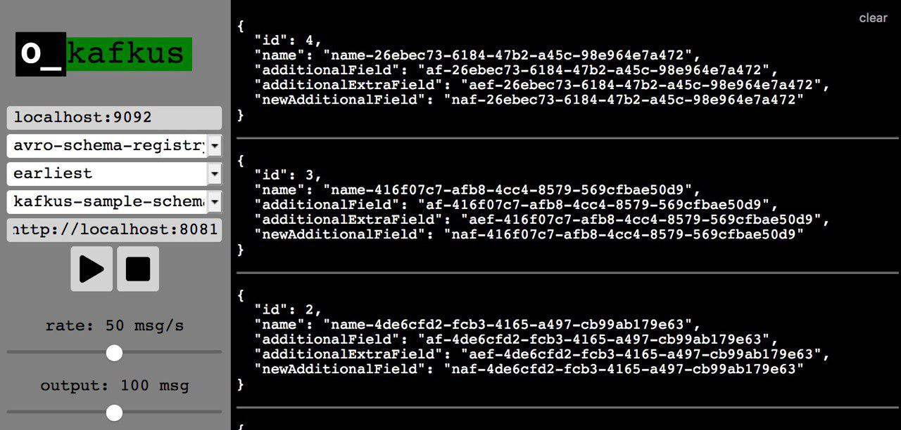

# kafkus
*backdoor key to kafka topics*

[](https://circleci.com/gh/dixel/kafkus)
[](http://spacemacs.org)

 



## Goal
Provide a minimalistic way ot inspect, what kind of data is available in a certain Kafka topic.

## Features
- Check contents of a Kafka topic with a functionality similar to `kafka-avro-console-consumer` and `kafka-console-consumer`
- 3 modes:
    - confluent schema registry (needs valid schema-registry-url) - handles the schema change on the flight
    - raw text format
    - raw avro schemas uploaded to the server folder (configured with `AVRO_SCHEMAS_PATH` env variable).
- Rate limiting (server-side, so that the load on Kafka is also limited).

## Running kafkus

If you already have a kafka setup with some data in the topics, you can configure Kafkus with some defaults and run it:

```bash
docker run -p 4040:4040 -v $PWD:/tmp \
    -e LOG_LEVEL=debug \
    -e AVRO_SCHEMAS_PATH=/tmp \
    -e LOAD_DEFAULT_CONFIG: "true" \
    -e DEFAULT_BOOTSTRAP_SERVER: localhost:9092 \
    -e DEFAULT_SCHEMA_REGISTRY_URL: "http://localhost:8081" \
    -e DEFAULT_MODE: avro-schema-registry \
    -e DEFAULT_AUTO_OFFSET_RESET: earliest \
    -e DEFAULT_RATE: 1 \
    -e DEFAULT_LIMIT: 1000 \
    -ti dixel/kafkus
```

In the browser, go to http://localhost:4040/, pick the topic, adjust the configuration and press "Play" to start consuming the data.
Kafkus tries to load the topics from server once the `boostrap.servers` gets unfocused or the `topic` dropdown menu gets opened.

## Configuration
Numerous configuration options are available, you can inspect them in the logs of kafkus during the startup.

## Implementation
The design goal was to make the application as composable as possible.
Clojure/clojurescript is used as the main language to allow more dynamism (which is useful, when you don't really know what kind of schemas are going to be used).
For client <-> server communication, amazing [sente](https://github.com/ptaoussanis/sente) library is used in a pure `ajax` mode (places where I use kafkus
have bad-behaving proxies).
[mount](https://github.com/tolitius/mount) is used for components management.

## Roadmap
- Better process/error communication (connected/failed to connect, etc...)
- Generating and producing the messages, validating the schema (carefully looking into [lancaster](https://github.com/deercreeklabs/lancaster) library)
- Improving the UX and giving the frontend part a bit more love (input welcome)
- Supporting other ser/de formats (protobuf, thrift)

## Motivation
- https://github.com/edenhill/kafkacat/issues/119
- clojure REPL was just fine for me most of the time, but it's not for everyone (check [samples](./dev/user.clj))
- POC for not using uber-frameworks for similar projects

## License

Copyright © 2018 Avdiushkin Vasilii

Distributed under the Eclipse Public License either version 1.0 or (at
your option) any later version.
