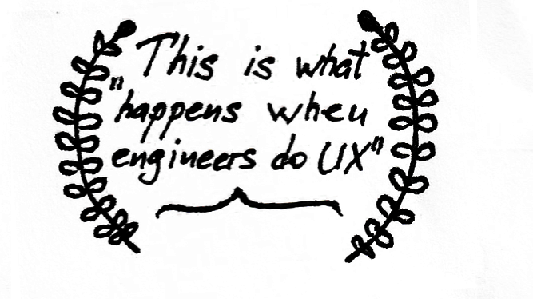
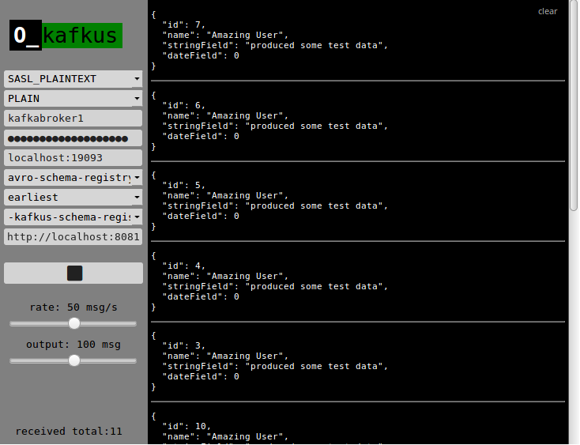

# kafkus
*backdoor key to kafka topics*

[](https://circleci.com/gh/dixel/kafkus)
[](http://spacemacs.org)

 



## Goal
Provide a minimalistic way to inspect, what kind of data is available in a certain Kafka topic.

## Features
- Tail log of a kafka topic (payload, key, offset information)
- 4 ways of deserializing:
    - confluent schema registry (needs valid schema-registry-url) - handles the schema change on the flight
    - raw text format
    - raw avro schemas uploaded to the server folder (configured with `AVRO_SCHEMAS_PATH` env variable).
    - json
- Producer mode, generates a dummy payload for schema-registry data
- Rate limiting (server-side, to also limit the load on kafka side).

## Running Kafkus

You can configure Kafkus with some defaults and run it using docker, or provide the configuration at runtime in the UI.

```bash
docker run -p 4040:4040 -v $PWD/schemas-repository:/tmp \
    -e LOG_LEVEL=debug \
    -e AVRO_SCHEMAS_PATH=/tmp \
    -e LOAD_DEFAULT_CONFIG=true \
    -e DEFAULT_BOOTSTRAP_SERVER=localhost:9092 \
    -e DEFAULT_SCHEMA_REGISTRY_URL=http://localhost:8081 \
    -e DEFAULT_MODE=avro-schema-registry \
    -e DEFAULT_AUTO_OFFSET_RESET=earliest \
    -e DEFAULT_RATE=1 \
    -e DEFAULT_LIMIT=1000 \
    -ti dixel/kafkus
```

Kafkus tries to load topics from server once the `boostrap.servers` field gets unfocused or the `topic` dropdown menu gets opened.
In a browser go to http://localhost:4040/, select some topic, adjust configuration and press "Play" to start consuming.

## Configuration
Kafkus is made mainly to be embeddable into existing dockerized ecosystem. Therefore, it's quite easy to start it together with a sample
kafka cluster with `docker-compose`. Check [examples](./examples).

## Roadmap
- Better process/error communication (connected/failed to connect, etc...)
- Improving UX and giving frontend part a bit more love (input welcome). Tried bootstrap on the consumer side slowed down the UI a lot and I wanted to keep it responsive when consuming > 1000 messages.
- Supporting other ser/de formats (protobuf, thrift)

## License

Copyright © 2018 Avdiushkin Vasilii

Distributed under the Eclipse Public License either version 1.0 or (at
your option) any later version.
