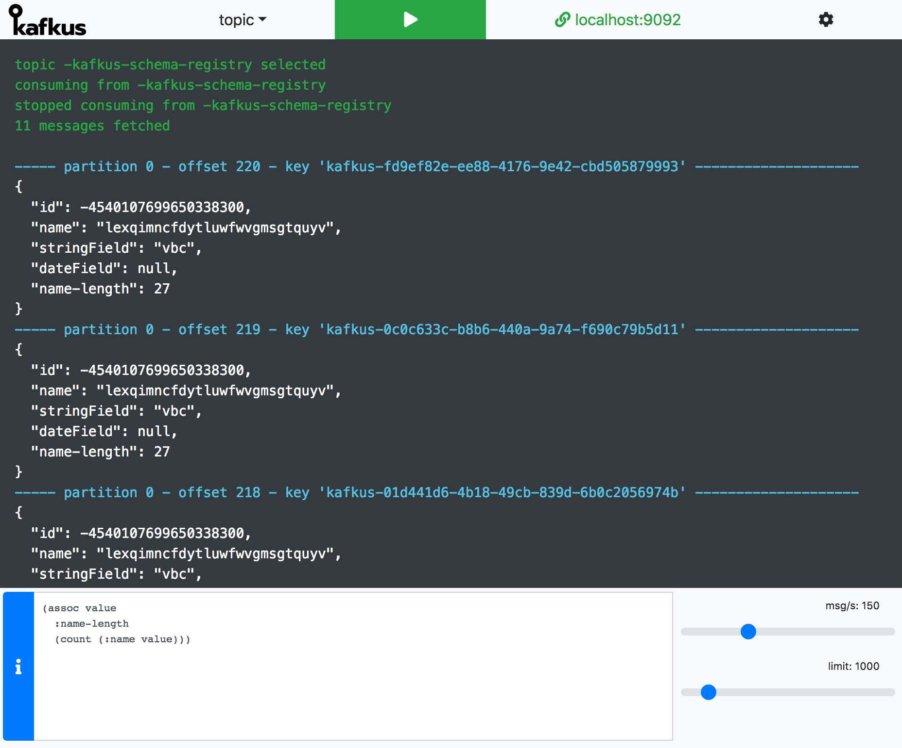

# kafkus
*backdoor key to kafka topics*

[](https://circleci.com/gh/dixel/kafkus)
[](http://spacemacs.org)



## Goal
Provide a minimalistic way to inspect, what kind of data is available in a certain Kafka topic.

## Features
- Tail log of kafka topic (payload, key, offset information)
- 4 ways of deserializing:
    - confluent schema registry (needs valid schema-registry-url)
    - raw
    - json
- Rate limiting (server-side, to also limit the load this tool puts on kafka).
- Single message transformation (client-side) with https://github.com/borkdude/sci

## Running Kafkus

You can configure Kafkus with defaults using environment variables and run it using docker, or provide the configuration at runtime in the UI.

```bash
docker run -p 4040:4040 \
    -e LOG_LEVEL=debug \
    -e AVRO_SCHEMAS_PATH=/tmp \
    -e LOAD_DEFAULT_CONFIG=true \
    -e DEFAULT_BOOTSTRAP_SERVER=localhost:9092 \
    -e DEFAULT_SCHEMA_REGISTRY_URL=http://localhost:8081 \
    -e DEFAULT_MODE=avro-schema-registry \
    -e DEFAULT_AUTO_OFFSET_RESET=earliest \
    -e DEFAULT_RATE=10 \
    -e DEFAULT_LIMIT=1000 \
    -ti dixel/kafkus:latest
```

## Configuration
Kafkus is made mainly to be embeddable into existing dockerized ecosystem (K8S/docker-compose).
You can use it in your existing environment with minimal effort.
Check [examples](./examples) for docker-compose with a sample kafka cluster and dummy producer.

## Roadmap

- Supporting other ser/de formats (protobuf, thrift).
- Command-line utility (hopefully a native binary built with GraalVM) to work with the server through WebSockets interface.
- Dump to a file instead of having the output on the screen
- Provide a one-time URL with all the configurations and SMT in place

## Thanks

For great UI/UX contribution and one weekend wasted together to [@vbldra](https://www.behance.net/vbldra).

To all the maintainers of the used libraries.

## License

Copyright © 2018 Avdiushkin Vasilii

Distributed under the Eclipse Public License either version 1.0 or (at
your option) any later version.
